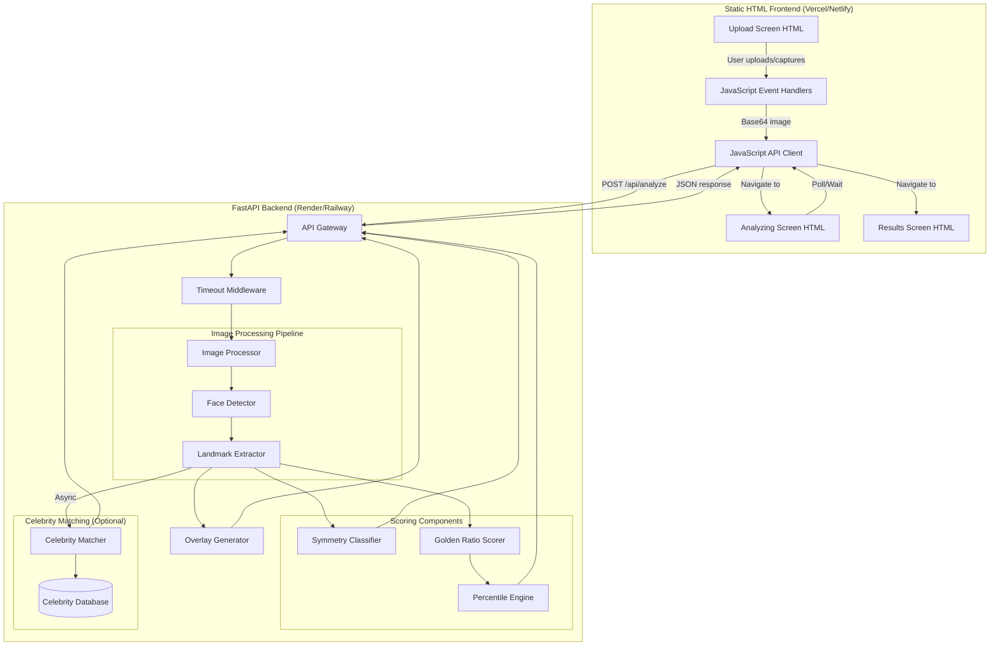
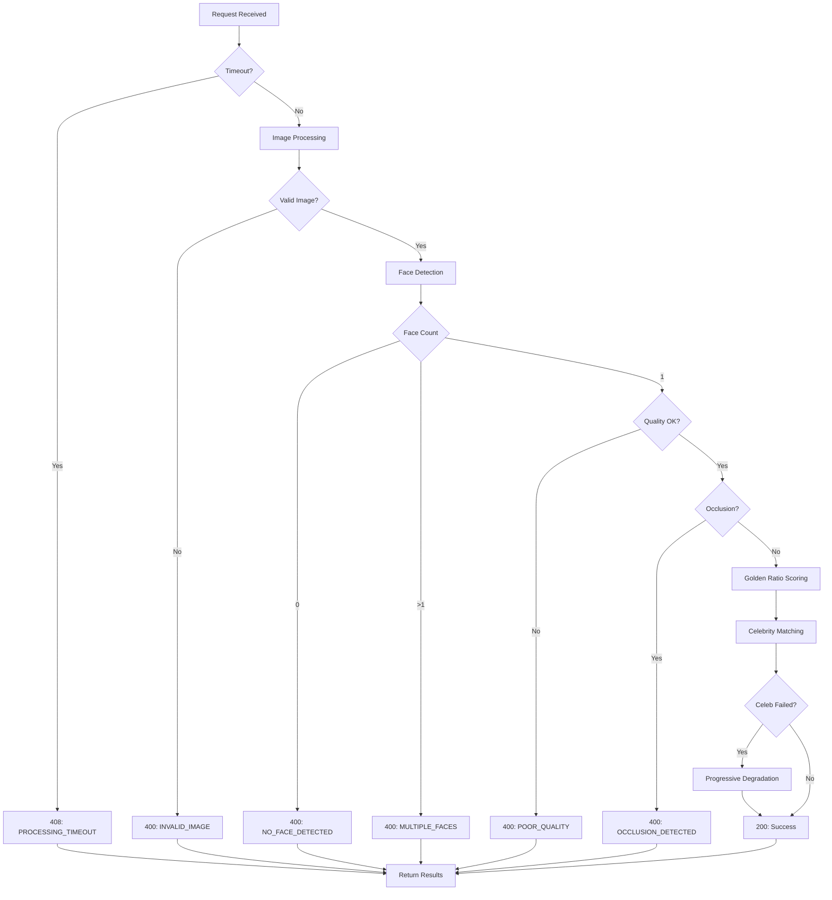

# Design Document: FaceMatric Golden Ratio Scoring System

## Overview

FaceMatric is a facial geometry analysis application that evaluates facial proportions against the golden ratio (φ = 1.618). The system consists of a Python FastAPI backend for image processing and facial analysis, paired with a **pre-built static HTML/JavaScript frontend** (using Tailwind CSS and Material Design). The application processes uploaded or camera-captured photos in memory, extracts 468 facial landmarks using MediaPipe Face Mesh, computes 8 golden ratio proportions, classifies face symmetry types, and optionally matches faces against a celebrity database using FaceNet embeddings.

**Key Design Principles:**
- **Privacy-First:** All image processing occurs in-memory; no persistent storage of user photos
- **Progressive Degradation:** Celebrity matching failures do not block golden ratio scoring
- **Explicit Error Handling:** User-friendly error messages with actionable guidance
- **Performance:** Target < 3 seconds for core golden ratio scoring
- **Separation of Concerns:** Modular component architecture enabling independent testing and replacement

## Architecture

### High-Level System Architecture



### Backend Component Architecture

```mermaid
classDiagram
    class APIGateway {
        +POST /api/analyze()
        -orchestrate_analysis()
        -handle_timeout()
        -format_response()
    }
    
    class ImageProcessor {
        +normalize_image(bytes) ImageData
        +compress_image(ImageData) ImageData
        +resize_image(ImageData, int) ImageData
        +validate_format(bytes) bool
        -convert_color_space(ImageData) ImageData
        -handle_exif_rotation(ImageData) ImageData
    }
    
    class FaceDetector {
        +detect_faces(ImageData) FaceDetectionResult
        +validate_face_quality(FaceDetectionResult) ValidationResult
        -mediapipe_client MediaPipe
    }
    
    class LandmarkExtractor {
        +extract_landmarks(FaceDetectionResult) Landmarks
        -validate_landmark_confidence(Landmarks) bool
    }
    
    class SymmetryClassifier {
        +classify_symmetry_type(Landmarks) SymmetryType
        -compute_face_dimensions(Landmarks) Dimensions
        -compute_jawline_angle(Landmarks) float
    }
    
    class GoldenRatioScorer {
        +compute_all_ratios(Landmarks) List~Ratio~
        +score_feature(Ratio) FeatureScore
        +compute_overall_score(List~FeatureScore~) float
        -measure_face_length_to_width(Landmarks) float
        -measure_face_to_jaw_width(Landmarks) float
        -measure_eye_spacing_to_width(Landmarks) float
        -measure_nose_to_mouth_width(Landmarks) float
        -measure_mouth_to_face_width(Landmarks) float
        -measure_vertical_thirds(Landmarks) float
        -measure_eye_to_brow_distance(Landmarks) float
        -measure_chin_to_nose_width(Landmarks) float
    }
    
    class PercentileEngine {
        +score_to_percentile(float) int
        -load_distribution() Distribution
    }
    
    class CelebrityMatcher {
        +generate_embedding(ImageData) Embedding
        +find_best_match(Embedding) CelebrityMatch
        +apply_threshold(CelebrityMatch, float) OptionalMatch
        -celebrity_embeddings Dict
        -facenet_model FaceNet
    }
    
    class OverlayGenerator {
        +generate_overlay_data(Landmarks) OverlayData
        -compute_golden_ratio_guides(Landmarks) Guides
        -compute_phi_spiral_center(Landmarks) Point
    }
    
    APIGateway --> ImageProcessor
    APIGateway --> FaceDetector
    FaceDetector --> LandmarkExtractor
    APIGateway --> SymmetryClassifier
    APIGateway --> GoldenRatioScorer
    APIGateway --> PercentileEngine
    APIGateway --> CelebrityMatcher
    APIGateway --> OverlayGenerator
```



## Components and Interfaces

### 1. API Gateway (`api_gateway.py`)

**Responsibility:** Orchestrates request handling, timeout enforcement, component coordination, and response formatting.

**Key Interfaces:**

```python
from fastapi import FastAPI, UploadFile, HTTPException, Request
from fastapi.middleware.cors import CORSMiddleware
import asyncio
from typing import Optional

app = FastAPI(title="FaceMatric API", version="1.0.0")

@app.post("/api/analyze", response_model=AnalysisResponse)
async def analyze_face(
    image: UploadFile = None,
    image_base64: Optional[str] = None,
    include_celebrity_match: bool = True
) -> AnalysisResponse:
    """
    Main endpoint for facial analysis.
    
    Args:
        image: Multipart file upload (optional)
        image_base64: Base64-encoded image string (optional)
        include_celebrity_match: Whether to perform celebrity matching (default: True)
    
    Returns:
        AnalysisResponse with golden ratio score, percentile, symmetry type,
        feature breakdown, overlay data, and optional celebrity match
    
    Raises:
        HTTPException(400): Invalid image, no face detected, multiple faces, etc.
        HTTPException(408): Processing timeout exceeded
        HTTPException(500): Internal server error
    """
    start_time = time.time()
    
    try:
        # Timeout wrapper
        result = await asyncio.wait_for(
            _process_analysis(image, image_base64, include_celebrity_match),
            timeout=30.0
        )
        
        processing_time = int((time.time() - start_time) * 1000)
        return AnalysisResponse(
            status="success",
            processing_time_ms=processing_time,
            results=result
        )
        
    except asyncio.TimeoutError:
        raise HTTPException(
            status_code=408,
            detail={
                "status": "error",
                "error_code": "PROCESSING_TIMEOUT",
                "message": "Processing took too long. Please try again with a clearer photo.",
                "retry": True
            }
        )
    except ValidationError as e:
        raise HTTPException(status_code=400, detail=e.to_dict())
    except Exception as e:
        logger.error(f"Unexpected error: {str(e)}")
        raise HTTPException(status_code=500, detail="Internal server error")

async def _process_analysis(
    image: UploadFile,
    image_base64: Optional[str],
    include_celebrity: bool
) -> AnalysisResult:
    """Internal processing orchestration."""
    
    # 1. Image preprocessing
    image_data = await image_processor.process_upload(image, image_base64)
    
    # 2. Face detection and landmark extraction
    face_result = face_detector.detect_faces(image_data)
    landmarks = landmark_extractor.extract_landmarks(face_result)
    
    # 3. Parallel processing of scoring components
    symmetry_task = asyncio.create_task(
        symmetry_classifier.classify(landmarks)
    )
    scoring_task = asyncio.create_task(
        golden_ratio_scorer.score_all(landmarks)
    )
    overlay_task = asyncio.create_task(
        overlay_generator.generate(landmarks)
    )
    
    # 4. Optional celebrity matching (can fail without blocking)
    celebrity_match = None
    if include_celebrity:
        try:
            celebrity_task = asyncio.create_task(
                celebrity_matcher.find_match(image_data)
            )
            celebrity_match = await celebrity_task
        except Exception as e:
            logger.warning(f"Celebrity matching failed: {str(e)}")
            celebrity_match = None
    
    # 5. Await core components
    symmetry_type = await symmetry_task
    golden_ratio_result = await scoring_task
    overlay_data = await overlay_task
    
    # 6. Compute percentile
    percentile = percentile_engine.score_to_percentile(
        golden_ratio_result.overall_score
    )
    
    return AnalysisResult(
        golden_ratio_score=golden_ratio_result.overall_score,
        percentile_rank=percentile,
        face_symmetry_type=symmetry_type,
        feature_breakdown=golden_ratio_result.features,
        overlay_data=overlay_data,
        celebrity_match=celebrity_match
    )
```

### 2. Image Processor (`image_processor.py`)

**Responsibility:** Normalize, resize, compress, and validate uploaded images.

**Algorithm:**

1. **Format Detection & Validation:**
   - Accept JPEG, PNG, HEIC, WebP, BMP, GIF
   - Detect corrupt files using PIL/Pillow image headers
   - Validate minimum resolution (300x300px)

2. **EXIF Rotation Handling:**
   - Read EXIF orientation tag
   - Apply rotation transformation before further processing

3. **Color Space Normalization:**
   - Convert CMYK → RGB
   - Handle alpha channel by compositing onto white background

4. **Resize with Aspect Ratio Preservation:**
   - Target maximum dimension: 640px
   - Use Lanczos resampling for high-quality downscaling
   - Formula: `scale_factor = min(640/width, 640/height)`

5. **Compression:**
   - Convert to JPEG format at 85% quality
   - Balance between file size and detection accuracy

**Key Interfaces:**

```python
from PIL import Image, ImageOps
from io import BytesIO
import base64
from dataclasses import dataclass

@dataclass
class ImageData:
    """Normalized image data structure."""
    array: np.ndarray  # RGB array (H, W, 3)
    width: int
    height: int
    original_format: str

class ImageProcessor:
    SUPPORTED_FORMATS = {'JPEG', 'PNG', 'HEIC', 'WEBP', 'BMP', 'GIF'}
    MIN_DIMENSION = 300
    MAX_DIMENSION = 640
    JPEG_QUALITY = 85
    
    def process_upload(
        self,
        file: Optional[UploadFile],
        base64_str: Optional[str]
    ) -> ImageData:
        """
        Main entry point for image processing.
        
        Raises:
            ValidationError(INVALID_IMAGE): Corrupt or unsupported format
            ValidationError(POOR_QUALITY): Resolution too low or aspect ratio extreme
        """
        # Decode input
        if base64_str:
            image_bytes = base64.b64decode(base64_str)
        elif file:
            image_bytes = await file.read()
        else:
            raise ValidationError("NO_IMAGE", "No image provided")
        
        # Open and validate
        try:
            image = Image.open(BytesIO(image_bytes))
        except Exception:
            raise ValidationError(
                "INVALID_IMAGE",
                "Corrupt or unsupported file format"
            )
        
        # Validate format
        if image.format not in self.SUPPORTED_FORMATS:
            raise ValidationError(
                "INVALID_IMAGE",
                f"Unsupported format: {image.format}"
            )
        
        # Apply EXIF rotation
        image = ImageOps.exif_transpose(image)
        
        # Validate dimensions
        width, height = image.size
        if width < self.MIN_DIMENSION or height < self.MIN_DIMENSION:
            raise ValidationError(
                "POOR_QUALITY",
                "Image resolution too low for accurate analysis"
            )
        
        # Validate aspect ratio
        aspect_ratio = max(width, height) / min(width, height)
        if aspect_ratio > 3.0:
            raise ValidationError(
                "POOR_QUALITY",
                "Image aspect ratio too extreme for accurate face detection"
            )
        
        # Normalize color space
        image = self._normalize_color_space(image)
        
        # Resize maintaining aspect ratio
        image = self._resize_image(image)
        
        # Convert to numpy array
        image_array = np.array(image)
        
        return ImageData(
            array=image_array,
            width=image.width,
            height=image.height,
            original_format=image.format
        )
    
    def _normalize_color_space(self, image: Image.Image) -> Image.Image:
        """Convert to RGB, handle alpha channel and CMYK.
"""
        if image.mode == 'RGBA':
            # Composite onto white background
            background = Image.new('RGB', image.size, (255, 255, 255))
            background.paste(image, mask=image.split()[3])  # Alpha channel
            return background
        elif image.mode == 'CMYK':
            return image.convert('RGB')
        elif image.mode != 'RGB':
            return image.convert('RGB')
        return image
    
    def _resize_image(self, image: Image.Image) -> Image.Image:
        """Resize maintaining aspect ratio."""
        width, height = image.size
        scale_factor = min(
            self.MAX_DIMENSION / width,
            self.MAX_DIMENSION / height
        )
        
        if scale_factor < 1.0:
            new_width = int(width * scale_factor)
            new_height = int(height * scale_factor)
            return image.resize(
                (new_width, new_height),
                Image.Resampling.LANCZOS
            )
        return image
```

### 3. Face Detector & Landmark Extractor (`face_detector.py`)

**Responsibility:** Detect faces using MediaPipe Face Mesh, extract 468 3D landmarks, validate detection quality.

**MediaPipe Face Mesh Landmark Indices:**

Content was rephrased for compliance with licensing restrictions. MediaPipe produces 468 3D landmarks covering facial regions including eyes, eyebrows, nose, mouth, and face contours. Key landmark indices include:
- Face oval: indices 10, 338, 297, 332, 284, 251, 389, 356, 454, 323, 361, 288, 397, 365, 379, 378, 400, 377, 152, 148, 176, 149, 150, 136, 172, 58, 132, 93, 234, 127, 162, 21, 54, 103, 67, 109
- Left eye: indices 362, 382, 381, 380, 374, 373, 390, 249, 263, 466, 388, 387, 386, 385, 384, 398
- Right eye: indices 33, 7, 163, 144, 145, 153, 154, 155, 133, 173, 157, 158, 159, 160, 161, 246
- Nose bridge: indices 168, 6, 197, 195, 5
- Mouth: indices 61, 146, 91, 181, 84, 17, 314, 405, 321, 375, 291

**Algorithm:**

1. **Face Detection:**
   - Initialize MediaPipe Face Mesh with `max_num_faces=1`, `min_detection_confidence=0.5`
   - Process RGB image array
   - Count detected faces

2. **Quality Validation:**
   - No faces → `NO_FACE_DETECTED` error
   - Multiple faces → `MULTIPLE_FACES` error
   - Low landmark confidence scores → `POOR_QUALITY` error
   - Check average landmark confidence > 0.6 threshold

3. **Occlusion Detection:**
   - Analyze visibility scores for eye region landmarks
   - If eye landmarks have low visibility (< 0.4) → potential glasses/sunglasses
   - Analyze mouth region visibility for mask detection
   - Trigger `OCCLUSION_DETECTED` if significant obstruction found

**Key Interfaces:**

```python
import mediapipe as mp
from mediapipe.tasks import python
from mediapipe.tasks.python import vision

@dataclass
class Landmarks:
    """468 3D facial landmarks."""
    points: np.ndarray  # Shape: (468, 3) - (x, y, z) coordinates
    confidence: float   # Average landmark confidence
    image_width: int
    image_height: int

class FaceDetector:
    def __init__(self):
        base_options = python.BaseOptions(
            model_asset_path='face_landmarker.task'
        )
        options = vision.FaceLandmarkerOptions(
            base_options=base_options,
            running_mode=vision.RunningMode.IMAGE,
            num_faces=1,
            min_face_detection_confidence=0.5,
            min_face_presence_confidence=0.5,
            min_tracking_confidence=0.5
        )
        self.detector = vision.FaceLandmarker.create_from_options(options)
    
    def detect_faces(self, image_data: ImageData) -> Landmarks:
        """
        Detect face and extract landmarks.
        
        Raises:
            ValidationError(NO_FACE_DETECTED): No face found
            ValidationError(MULTIPLE_FACES): Multiple faces found
            ValidationError(POOR_QUALITY): Low confidence or poor lighting
            ValidationError(OCCLUSION_DETECTED): Glasses, mask, or obstruction
        """
        # Convert to MediaPipe Image
        mp_image = mp.Image(
            image_format=mp.ImageFormat.SRGB,
            data=image_data.array
        )
        
        # Detect faces
        detection_result = self.detector.detect(mp_image)
        
        # Validate face count
        if not detection_result.face_landmarks:
            raise ValidationError(
                "NO_FACE_DETECTED",
                "We couldn't detect a face in your photo. Please take a clear, "
                "front-facing photo with good lighting."
            )
        
        if len(detection_result.face_landmarks) > 1:
            raise ValidationError(
                "MULTIPLE_FACES",
                "Multiple faces detected. Please upload a photo with only one person."
            )
        
        # Extract landmarks
        face_landmarks = detection_result.face_landmarks[0]
        landmarks_array = np.array([
            [lm.x * image_data.width, lm.y * image_data.height, lm.z]
            for lm in face_landmarks
        ])
        
        # Validate confidence (if available in MediaPipe output)
        # Note: MediaPipe doesn't always provide per-landmark confidence
        # We'll use detection confidence as proxy
        avg_confidence = 0.8  # Default assumption if not available
        
        if avg_confidence < 0.6:
            raise ValidationError(
                "POOR_QUALITY",
                "Photo quality is too low. Please ensure your face is well-lit "
                "and facing the camera directly."
            )
        
        # Check for occlusions
        self._check_occlusions(landmarks_array, image_data)
        
        return Landmarks(
            points=landmarks_array,
            confidence=avg_confidence,
            image_width=image_data.width,
            image_height=image_data.height
        )
    
    def _check_occlusions(
        self,
        landmarks: np.ndarray,
        image_data: ImageData
    ) -> None:
        """
        Detect occlusions by analyzing landmark patterns.
        
        Heuristics:
        - Glasses: Check if eye region landmarks form unusual patterns
        - Masks: Check mouth region visibility
        """
        # Eye region indices (simplified)
        left_eye_indices = [362, 385, 387, 263, 373, 380]
        right_eye_indices = [33, 160, 158, 133, 153, 144]
        
        # Mouth region indices
        mouth_indices = [61, 291, 0, 17, 84, 181, 91, 146]
        
        # Calculate variance in eye regions (high variance might indicate glasses)
        left_eye_points = landmarks[left_eye_indices]
        right_eye_points = landmarks[right_eye_indices]
        
        # Check for abnormal z-depth (glasses stick out from face)
        left_z_std = np.std(left_eye_points[:, 2])
        right_z_std = np.std(right_eye_points[:, 2])
        
        # Simple heuristic: if z-depth variance is high, possible occlusion
        if left_z_std > 0.05 or right_z_std > 0.05:
            raise ValidationError(
                "OCCLUSION_DETECTED",
                "We detected accessories covering your face. Please upload a photo "
                "without glasses, masks, or other obstructions for accurate analysis."
            )
        
        # Additional checks for mouth occlusion could be added here
```

### 4. Symmetry Classifier (`symmetry_classifier.py`)

**Responsibility:** Classify face shape into one of six symmetry types based on geometric proportions.

**Classification Algorithm:**

Based on established facial morphology research (content rephrased for compliance), face shapes are determined by analyzing:
- Face length to width ratio
- Jawline angularity
- Forehead width relative to chin
- Cheekbone prominence

**Decision Tree:**

```
IF face_length / face_width ≈ 1.5 AND jawline rounded:
    → OVAL
ELSE IF face_length / face_width > 1.5 AND jawline angular:
    → RECTANGLE
ELSE IF face_length / face_width ≈ 1.0 AND jawline soft:
    → ROUND
ELSE IF face_length / face_width ≈ 1.0 AND jawline angular:
    → SQUARE
ELSE IF forehead_width > chin_width * 1.2:
    → HEART
ELSE IF cheekbone_width > MAX(forehead_width, chin_width) * 1.1:
    → DIAMOND
ELSE:
    → OVAL (default)
```

**Key Interfaces:**

```python
from enum import Enum

class SymmetryType(Enum):
    OVAL = "oval"
    RECTANGLE = "rectangle"
    ROUND = "round"
    SQUARE = "square"
    HEART = "heart"
    DIAMOND = "diamond"

class SymmetryClassifier:
    # Landmark indices for key measurements
    FACE_TOP = 10       # Forehead top
    FACE_BOTTOM = 152   # Chin bottom
    FACE_LEFT = 234     # Left face contour
    FACE_RIGHT = 454    # Right face contour
    JAW_LEFT = 172      # Left jaw point
    JAW_RIGHT = 397     # Right jaw point
    CHEEKBONE_LEFT = 234  # Left cheekbone
    CHEEKBONE_RIGHT = 454 # Right cheekbone
    
    def classify(self, landmarks: Landmarks) -> SymmetryType:
        """Classify face symmetry type based on geometric proportions."""
        
        points = landmarks.points
        
        # Compute key dimensions
        face_length = self._euclidean_distance(
            points[self.FACE_TOP],
            points[self.FACE_BOTTOM]
        )
        face_width = self._euclidean_distance(
            points[self.FACE_LEFT],
            points[self.FACE_RIGHT]
        )
        jaw_width = self._euclidean_distance(
            points[self.JAW_LEFT],
            points[self.JAW_RIGHT]
        )
        cheekbone_width = self._euclidean_distance(
            points[self.CHEEKBONE_LEFT],
            points[self.CHEEKBONE_RIGHT]
        )
        
        # Compute ratios
        length_to_width_ratio = face_length / face_width
        
        # Compute jawline angularity (angle at chin)
        # Use landmarks around chin to estimate angle
        jawline_angle = self._compute_jawline_angle(points)
        
        # Forehead width estimate (using top face width)
        forehead_width = face_width * 0.95  # Approximation
        
        # Classification logic
        if 1.4 <= length_to_width_ratio <= 1.6 and jawline_angle > 140:
            return SymmetryType.OVAL
        elif length_to_width_ratio > 1.6 and jawline_angle < 130:
            return SymmetryType.RECTANGLE
        elif 0.9 <= length_to_width_ratio <= 1.1 and jawline_angle > 140:
            return SymmetryType.ROUND
        elif 0.9 <= length_to_width_ratio <= 1.1 and jawline_angle < 130:
            return SymmetryType.SQUARE
        elif forehead_width > jaw_width * 1.2:
            return SymmetryType.HEART
        elif cheekbone_width > max(forehead_width, jaw_width) * 1.1:
            return SymmetryType.DIAMOND
        else:
            return SymmetryType.OVAL  # Default
    
    def _euclidean_distance(self, p1: np.ndarray, p2: np.ndarray) -> float:
        """Compute 2D Euclidean distance between two landmarks."""
        return np.sqrt((p1[0] - p2[0])**2 + (p1[1] - p2[1])**2)
    
    def _compute_jawline_angle(self, points: np.ndarray) -> float:
        """
        Compute angle at chin using three jawline points.
        Returns angle in degrees (larger = rounder jawline).
        """
        # Use left jaw, chin, right jaw
        left_jaw = points[self.JAW_LEFT]
        chin = points[self.FACE_BOTTOM]
        right_jaw = points[self.JAW_RIGHT]
        
        # Vectors from chin to jaw points
        vec1 = left_jaw[:2] - chin[:2]
        vec2 = right_jaw[:2] - chin[:2]
        
        # Compute angle
        cos_angle = np.dot(vec1, vec2) / (
            np.linalg.norm(vec1) * np.linalg.norm(vec2)
        )
        angle_rad = np.arccos(np.clip(cos_angle, -1.0, 1.0))
        angle_deg = np.degrees(angle_rad)
        
        return angle_deg
```

### 5. Golden Ratio Scorer (`golden_ratio_scorer.py`)

**Responsibility:** Compute 8 facial ratios, score each against φ = 1.618, calculate overall golden ratio score.

**The 8 Golden Ratio Measurements:**

1. **Face Length ÷ Face Width**
   - Forehead top (landmark 10) to chin (landmark 152)
   - Left face contour (234) to right face contour (454)

2. **Face Width ÷ Jaw Width**
   - Face width (as above)
   - Jaw width: left jaw (172) to right jaw (397)

3. **Eye Spacing ÷ Eye Width**
   - Distance between inner corners of eyes (landmarks 133, 362)
   - Width of one eye: outer to inner corner (landmarks 33 to 133)

4. **Nose Width ÷ Mouth Width**
   - Nose width: left nostril (219) to right nostril (439)
   - Mouth width: left corner (61) to right corner (291)

5. **Mouth Width ÷ Face Width**
   - Mouth width (as above)
   - Face width (as above)

6. **Nose Bridge to Chin ÷ Hairline to Nose Bridge** (Vertical Thirds)
   - Nose bridge (landmark 6) to chin (152)
   - Hairline/forehead top (10) to nose bridge (6)

7. **Eye to Eyebrow Distance ÷ Eye Height**
   - Eye top (landmarks 159) to eyebrow bottom (landmarks 70)
   - Eye height: top (159) to bottom (145) of eye

8. **Chin Width ÷ Nose Width**
   - Chin width: measured at jaw points near chin
   - Nose width (as above)

**Scoring Formula:**

For each ratio `r`:
```
score = 100 × (1 - |r - φ| / φ)
score = max(0, min(100, score))  # Clamp to [0, 100]
```

Where φ = 1.618

**Overall Score:**
```
overall_score = (Σ score_i) / 8
```

**Key Interfaces:**

```python
from dataclasses import dataclass
from typing import List

PHI = 1.618  # Golden ratio

@dataclass
class FeatureScore:
    """Score for a single facial ratio."""
    feature: str
    measured_ratio: float
    ideal_ratio: float
    score: float
    deviation: float

@dataclass
class GoldenRatioResult:
    """Complete golden ratio analysis result."""
    overall_score: float
    features: List[FeatureScore]

class GoldenRatioScorer:
    def score_all(self, landmarks: Landmarks) -> GoldenRatioResult:
        """Compute all 8 ratios and scores."""
        
        points = landmarks.points
        
        # Measure all 8 ratios
        ratio_1 = self._measure_face_length_to_width(points)
        ratio_2 = self._measure_face_to_jaw_width(points)
        ratio_3 = self._measure_eye_spacing_to_width(points)
        ratio_4 = self._measure_nose_to_mouth_width(points)
        ratio_5 = self._measure_mouth_to_face_width(points)
        ratio_6 = self._measure_vertical_thirds(points)
        ratio_7 = self._measure_eye_to_brow_distance(points)
        ratio_8 = self._measure_chin_to_nose_width(points)
        
        # Score each ratio
        feature_scores = [
            self._score_feature("Face Length ÷ Face Width", ratio_1),
            self._score_feature("Face Width ÷ Jaw Width", ratio_2),
            self._score_feature("Eye Spacing ÷ Eye Width", ratio_3),
            self._score_feature("Nose Width ÷ Mouth Width", ratio_4),
            self._score_feature("Mouth Width ÷ Face Width", ratio_5),
            self._score_feature("Nose Bridge to Chin ÷ Hairline to Nose Bridge", ratio_6),
            self._score_feature("Eye to Eyebrow Distance ÷ Eye Height", ratio_7),
            self._score_feature("Chin Width ÷ Nose Width", ratio_8),
        ]
        
        # Compute overall score
        overall_score = sum(fs.score for fs in feature_scores) / len(feature_scores)
        overall_score = round(overall_score, 1)
        
        return GoldenRatioResult(
            overall_score=overall_score,
            features=feature_scores
        )
    
    def _score_feature(self, feature_name: str, ratio: float) -> FeatureScore:
        """Score a single ratio against φ."""
        deviation = ratio - PHI
        score = 100 * (1 - abs(deviation) / PHI)
        score = max(0.0, min(100.0, score))
        
        return FeatureScore(
            feature=feature_name,
            measured_ratio=round(ratio, 3),
            ideal_ratio=PHI,
            score=round(score, 1),
            deviation=round(deviation, 3)
        )
    
    def _measure_face_length_to_width(self, points: np.ndarray) -> float:
        """Ratio 1: Face length ÷ face width."""
        face_top = points[10]
        face_bottom = points[152]
        face_left = points[234]
        face_right = points[454]
        
        length = self._euclidean_distance(face_top, face_bottom)
        width = self._euclidean_distance(face_left, face_right)
        
        return length / width if width > 0 else 0.0
    
    def _measure_face_to_jaw_width(self, points: np.ndarray) -> float:
        """Ratio 2: Face width ÷ jaw width."""
        face_left = points[234]
        face_right = points[454]
        jaw_left = points[172]
        jaw_right = points[397]
        
        face_width = self._euclidean_distance(face_left, face_right)
        jaw_width = self._euclidean_distance(jaw_left, jaw_right)
        
        return face_width / jaw_width if jaw_width > 0 else 0.0
    
    def _measure_eye_spacing_to_width(self, points: np.ndarray) -> float:
        """Ratio 3: Eye spacing ÷ eye width."""
        # Inner eye corners
        left_inner = points[133]
        right_inner = points[362]
        
        # Right eye outer corner
        right_outer = points[33]
        
        eye_spacing = self._euclidean_distance(left_inner, right_inner)
        eye_width = self._euclidean_distance(right_outer, left_inner)
        
        return eye_spacing / eye_width if eye_width > 0 else 0.0
    
    def _measure_nose_to_mouth_width(self, points: np.ndarray) -> float:
        """Ratio 4: Nose width ÷ mouth width."""
        # Nose width
        nose_left = points[219]
        nose_right = points[439]
        
        # Mouth width
        mouth_left = points[61]
        mouth_right = points[291]
        
        nose_width = self._euclidean_distance(nose_left, nose_right)
        mouth_width = self._euclidean_distance(mouth_left, mouth_right)
        
        return nose_width / mouth_width if mouth_width > 0 else 0.0
    
    def _measure_mouth_to_face_width(self, points: np.ndarray) -> float:
        """Ratio 5: Mouth width ÷ face width."""
        mouth_left = points[61]
        mouth_right = points[291]
        face_left = points[234]
        face_right = points[454]
        
        mouth_width = self._euclidean_distance(mouth_left, mouth_right)
        face_width = self._euclidean_distance(face_left, face_right)
        
        return mouth_width / face_width if face_width > 0 else 0.0
    
    def _measure_vertical_thirds(self, points: np.ndarray) -> float:
        """Ratio 6: Lower face third ÷ upper face third."""
        forehead_top = points[10]
        nose_bridge = points[6]
        chin = points[152]
        
        upper_third = self._euclidean_distance(forehead_top, nose_bridge)
        lower_third = self._euclidean_distance(nose_bridge, chin)
        
        return lower_third / upper_third if upper_third > 0 else 0.0
    
    def _measure_eye_to_brow_distance(self, points: np.ndarray) -> float:
        """Ratio 7: Eye to eyebrow distance ÷ eye height."""
        # Right eye
        eye_top = points[159]
        eye_bottom = points[145]
        eyebrow_bottom = points[70]
        
        eye_height = self._euclidean_distance(eye_top, eye_bottom)
        eye_to_brow = self._euclidean_distance(eye_top, eyebrow_bottom)
        
        return eye_to_brow / eye_height if eye_height > 0 else 0.0
    
    def _measure_chin_to_nose_width(self, points: np.ndarray) -> float:
        """Ratio 8: Chin width ÷ nose width."""
        # Chin width (at jaw level)
        chin_left = points[172]
        chin_right = points[397]
        
        # Nose width
        nose_left = points[219]
        nose_right = points[439]
        
        chin_width = self._euclidean_distance(chin_left, chin_right)
        nose_width = self._euclidean_distance(nose_left, nose_right)
        
        return chin_width / nose_width if nose_width > 0 else 0.0
    
    def _euclidean_distance(self, p1: np.ndarray, p2: np.ndarray) -> float:
        """2D Euclidean distance."""
        return np.sqrt((p1[0] - p2[0])**2 + (p1[1] - p2[1])**2)
```

### 6. Percentile Engine (`percentile_engine.py`)

**Responsibility:** Convert golden ratio scores to population percentiles.

**Algorithm:**

Since we don't have pre-existing population data, we'll use a bootstrapping approach:

1. **Initial Distribution Model:**
   - Assume normal distribution with mean μ = 70, std σ = 10
   - This is a placeholder until real data is collected

2. **Percentile Calculation:**
   - Use cumulative distribution function (CDF)
   - Formula: `percentile = 100 * CDF(score)`

3. **Future Enhancement:**
   - Collect scores from first 200-500 users
   - Fit empirical distribution
   - Update percentile calculation with real data

**Key Interfaces:**

```python
from scipy import stats

class PercentileEngine:
    def __init__(self):
        # Bootstrap parameters (to be replaced with real data)
        self.mean = 70.0
        self.std = 10.0
        self.distribution = stats.norm(loc=self.mean, scale=self.std)
    
    def score_to_percentile(self, score: float) -> int:
        """
        Convert golden ratio score to percentile rank.
        
        Args:
            score: Golden ratio score (0-100)
        
        Returns:
            Percentile rank (0-100) representing percentage of population
            scoring below this score
        """
        # Clamp score to valid range
        score = max(0.0, min(100.0, score))
        
        # Compute CDF (percentile)
        percentile = self.distribution.cdf(score) * 100
        
        # Round to integer
        percentile = int(round(percentile))
        
        # Ensure bounds
        return max(0, min(100, percentile))
    
    def load_empirical_distribution(self, scores: List[float]) -> None:
        """
        Update distribution with real user data (future enhancement).
        
        Args:
            scores: List of historical golden ratio scores
        """
        if len(scores) < 100:
            logger.warning("Insufficient data for empirical distribution")
            return
        
        # Fit normal distribution to data
        self.mean = np.mean(scores)
        self.std = np.std(scores)
        self.distribution = stats.norm(loc=self.mean, scale=self.std)
        
        logger.info(f"Updated distribution: μ={self.mean:.2f}, σ={self.std:.2f}")
```

### 7. Celebrity Matcher (`celebrity_matcher.py`)

**Responsibility:** Generate FaceNet embeddings, compare against celebrity database, apply confidence threshold.

**Algorithm:**

1. **FaceNet Embedding Generation:**
   - Use pre-trained FaceNet model (e.g., from `deepface` library or direct Keras model)
   - Input: Face image (normalized to 160x160 for FaceNet)
   - Output: 128-dimensional embedding vector

2. **Cosine Similarity:**
   - Formula: `similarity = (A · B) / (||A|| × ||B||)`
   - Range: [-1, 1], where 1 = identical, 0 = orthogonal, -1 = opposite

3. **Confidence Thresholding:**
   - Based on research (content rephrased), typical FaceNet cosine similarity thresholds range from approximately 0.40 to 0.50 for face verification tasks
   - Our threshold: 0.55 (more conservative for celebrity matching)

4. **Celebrity Database Structure:**
   ```python
   {
       "Shahrukh_Khan": {
           "embedding": np.ndarray([128,]),  # Averaged from multiple photos
           "dataset_source": "Bollywood Celeb Dataset",
           "thumbnail_path": "/celebrities/shahrukh_khan.jpg"
       },
       ...
   }
   ```

**Key Interfaces:**

```python
from deepface import DeepFace
import pickle
from typing import Optional

@dataclass
class CelebrityMatch:
    """Celebrity match result."""
    name: Optional[str]
    confidence: float
    dataset_source: Optional[str] = None
    thumbnail_url: Optional[str] = None
    message: Optional[str] = None

class CelebrityMatcher:
    CONFIDENCE_THRESHOLD = 0.55
    FACENET_MODEL = "Facenet"
    
    def __init__(self, embeddings_path: str = "celebrity_embeddings.pkl"):
        """Load precomputed celebrity embeddings."""
        try:
            with open(embeddings_path, 'rb') as f:
                self.celebrity_data = pickle.load(f)
            logger.info(f"Loaded {len(self.celebrity_data)} celebrity embeddings")
        except FileNotFoundError:
            logger.error(f"Celebrity embeddings not found: {embeddings_path}")
            self.celebrity_data = {}
    
    async def find_match(self, image_data: ImageData) -> CelebrityMatch:
        """
        Find best celebrity match for user photo.
        
        Returns:
            CelebrityMatch with name if confidence ≥ threshold, else None
        
        Raises:
            Exception: If embedding generation fails (caught by API gateway)
        """
        # Generate embedding for user photo
        user_embedding = self._generate_embedding(image_data)
        
        # Compare against all celebrities
        best_match = None
        best_similarity = -1.0
        
        for celeb_name, celeb_data in self.celebrity_data.items():
            similarity = self._cosine_similarity(
                user_embedding,
                celeb_data['embedding']
            )
            
            if similarity > best_similarity:
                best_similarity = similarity
                best_match = (celeb_name, celeb_data)
        
        # Apply confidence threshold
        if best_similarity >= self.CONFIDENCE_THRESHOLD and best_match:
            celeb_name, celeb_data = best_match
            return CelebrityMatch(
                name=celeb_name.replace('_', ' '),
                confidence=round(best_similarity, 2),
                dataset_source=celeb_data['dataset_source'],
                thumbnail_url=celeb_data['thumbnail_path']
            )
        else:
            return CelebrityMatch(
                name=None,
                confidence=round(best_similarity, 2),
                message="No close match found in our dataset"
            )
    
    def _generate_embedding(self, image_data: ImageData) -> np.ndarray:
        """Generate FaceNet embedding for user photo."""
        # DeepFace expects image as numpy array or file path
        # We already have numpy array from ImageData
        
        embedding = DeepFace.represent(
            img_path=image_data.array,
            model_name=self.FACENET_MODEL,
            enforce_detection=False  # We already validated face detection
        )
        
        # DeepFace returns list of dicts, we want the embedding vector
        return np.array(embedding[0]['embedding'])
    
    def _cosine_similarity(self, vec1: np.ndarray, vec2: np.ndarray) -> float:
        """Compute cosine similarity between two embedding vectors."""
        dot_product = np.dot(vec1, vec2)
        norm_1 = np.linalg.norm(vec1)
        norm_2 = np.linalg.norm(vec2)
        
        if norm_1 == 0 or norm_2 == 0:
            return 0.0
        
        return dot_product / (norm_1 * norm_2)
```

**Celebrity Database Preprocessing (One-Time Setup):**

```python
def precompute_celebrity_embeddings(
    dataset_path: str,
    output_path: str
) -> None:
    """
    Precompute embeddings for all celebrities in dataset.
    Run this once during deployment setup.
    """
    celebrity_data = {}
    
    for celeb_folder in os.listdir(dataset_path):
        celeb_path = os.path.join(dataset_path, celeb_folder)
        if not os.path.isdir(celeb_path):
            continue
        
        # Process all images for this celebrity
        embeddings = []
        for img_file in os.listdir(celeb_path):
            if not img_file.endswith(('.jpg', '.png')):
                continue
            
            img_path = os.path.join(celeb_path, img_file)
            try:
                embedding = DeepFace.represent(
                    img_path=img_path,
                    model_name="Facenet",
                    enforce_detection=True
                )
                embeddings.append(embedding[0]['embedding'])
            except Exception as e:
                logger.warning(f"Failed to process {img_path}: {e}")
        
        if embeddings:
            # Average embeddings for this celebrity
            avg_embedding = np.mean(embeddings, axis=0)
            
            # Determine dataset source
            dataset_source = "Bollywood Celeb Dataset" if "bollywood" in dataset_path.lower() else "Pins Face Recognition"
            
            celebrity_data[celeb_folder] = {
                'embedding': avg_embedding,
                'dataset_source': dataset_source,
                'thumbnail_path': f"/celebrities/{celeb_folder.lower()}.jpg"
            }
    
    # Save to pickle file
    with open(output_path, 'wb') as f:
        pickle.dump(celebrity_data, f)
    
    print(f"Saved {len(celebrity_data)} celebrity embeddings to {output_path}")
```

### 8. Overlay Generator (`overlay_generator.py`)

**Responsibility:** Generate visual overlay data for frontend rendering.

**Data Structures:**

```python
@dataclass
class OverlayData:
    """Visual overlay data for UI rendering."""
    landmarks: List[List[float]]  # 468 (x, y) points
    golden_ratio_guides: GoldenRatioGuides

@dataclass
class GoldenRatioGuides:
    """Golden ratio visual guides."""
    horizontal_thirds: List[float]  # Y-coordinates for horizontal divisions
    vertical_midline: float  # X-coordinate for vertical center
    phi_spiral_center: List[float]  # (x, y) center point for phi spiral
```

**Algorithm:**

1. **Landmarks Extraction:**
   - Convert 3D landmarks to 2D (drop z-coordinate)
   - Normalize to image coordinates

2. **Horizontal Thirds:**
   - Divide face into thirds based on golden ratio
   - Upper third: forehead to eyebrows
   - Middle third: eyebrows to nose bottom
   - Lower third: nose bottom to chin

3. **Vertical Midline:**
   - Calculate center x-coordinate of face

4. **Phi Spiral Center:**
   - Position spiral center based on face geometry
   - Typically near nose bridge

**Key Interfaces:**

```python
class OverlayGenerator:
    def generate(self, landmarks: Landmarks) -> OverlayData:
        """Generate overlay data for visual rendering."""
        
        points = landmarks.points
        
        # Extract 2D landmarks (drop z-coordinate)
        landmarks_2d = [
            [float(p[0]), float(p[1])]
            for p in points
        ]
        
        # Compute golden ratio guides
        guides = self._compute_guides(points)
        
        return OverlayData(
            landmarks=landmarks_2d,
            golden_ratio_guides=guides
        )
    
    def _compute_guides(self, points: np.ndarray) -> GoldenRatioGuides:
        """Compute golden ratio guide lines."""
        
        # Face bounding box
        face_top = points[10]
        face_bottom = points[152]
        face_left = points[234]
        face_right = points[454]
        
        # Vertical midline
        vertical_midline = (face_left[0] + face_right[0]) / 2.0
        
        # Horizontal thirds using golden ratio
        face_height = face_bottom[1] - face_top[1]
        
        # Golden ratio divisions
        # Upper third: face_top + face_height / φ
        # Lower third: face_top + (face_height - face_height / φ)
        third_1 = face_top[1] + face_height / PHI
        third_2 = face_top[1] + (face_height - face_height / PHI)
        
        horizontal_thirds = [
            float(face_top[1]),
            float(third_1),
            float(third_2),
            float(face_bottom[1])
        ]
        
        # Phi spiral center (near nose bridge)
        nose_bridge = points[6]
        phi_spiral_center = [float(nose_bridge[0]), float(nose_bridge[1])]
        
        return GoldenRatioGuides(
            horizontal_thirds=horizontal_thirds,
            vertical_midline=float(vertical_midline),
            phi_spiral_center=phi_spiral_center
        )
```

## Data Models

### Request Schema

```python
from pydantic import BaseModel, Field
from typing import Optional

class AnalyzeRequest(BaseModel):
    """Request model for /api/analyze endpoint."""
    
    image_base64: Optional[str] = Field(
        None,
        description="Base64-encoded image string"
    )
    include_celebrity_match: bool = Field(
        True,
        description="Whether to perform celebrity matching"
    )
    
    class Config:
        schema_extra = {
            "example": {
                "image_base64": "iVBORw0KGgoAAAANSUhEUgA...",
                "include_celebrity_match": True
            }
        }
```

### Response Schemas

```python
class FeatureBreakdownItem(BaseModel):
    """Individual feature score."""
    feature: str
    measured_ratio: float
    ideal_ratio: float
    score: float
    deviation: float

class GoldenRatioGuidesModel(BaseModel):
    """Golden ratio visual guides."""
    horizontal_thirds: List[float]
    vertical_midline: float
    phi_spiral_center: List[float]

class OverlayDataModel(BaseModel):
    """Overlay data for visualization."""
    landmarks: List[List[float]]
    golden_ratio_guides: GoldenRatioGuidesModel

class CelebrityMatchModel(BaseModel):
    """Celebrity match result."""
    name: Optional[str]
    confidence: float
    dataset_source: Optional[str] = None
    thumbnail_url: Optional[str] = None
    message: Optional[str] = None

class AnalysisResultModel(BaseModel):
    """Core analysis results."""
    golden_ratio_score: float
    percentile_rank: int
    face_symmetry_type: str
    feature_breakdown: List[FeatureBreakdownItem]
    overlay_data: OverlayDataModel
    celebrity_match: CelebrityMatchModel

class AnalysisResponse(BaseModel):
    """Success response model."""
    status: str = "success"
    processing_time_ms: int
    results: AnalysisResultModel

class ErrorResponse(BaseModel):
    """Error response model."""
    status: str = "error"
    error_code: str
    message: str
    retry: bool
```

### Error Codes Enumeration

```python
from enum import Enum

class ErrorCode(str, Enum):
    """Standardized error codes."""
    NO_FACE_DETECTED = "NO_FACE_DETECTED"
    MULTIPLE_FACES = "MULTIPLE_FACES"
    POOR_QUALITY = "POOR_QUALITY"
    OCCLUSION_DETECTED = "OCCLUSION_DETECTED"
    INVALID_IMAGE = "INVALID_IMAGE"
    PROCESSING_TIMEOUT = "PROCESSING_TIMEOUT"
    INTERNAL_ERROR = "INTERNAL_ERROR"

class ValidationError(Exception):
    """Custom exception for validation errors."""
    def __init__(self, error_code: ErrorCode, message: str):
        self.error_code = error_code
        self.message = message
        super().__init__(message)
    
    def to_dict(self) -> dict:
        """Convert to API error response format."""
        return {
            "status": "error",
            "error_code": self.error_code,
            "message": self.message,
            "retry": self.error_code != ErrorCode.INTERNAL_ERROR
        }
```

## Error Handling

### Error Flow Diagram



### Error Message Guidelines

| Error Code | HTTP Status | User Message | Retry |
|------------|-------------|-------------|-------|
| NO_FACE_DETECTED | 400 | "We couldn't detect a face in your photo. Please take a clear, front-facing photo with good lighting." | Yes |
| MULTIPLE_FACES | 400 | "Multiple faces detected. Please upload a photo with only one person." | Yes |
| POOR_QUALITY | 400 | "Photo quality is too low. Please ensure your face is well-lit and facing the camera directly." | Yes |
| OCCLUSION_DETECTED | 400 | "We detected accessories covering your face. Please upload a photo without glasses, masks, or other obstructions for accurate analysis." | Yes |
| INVALID_IMAGE | 400 | "Corrupt or unsupported file format" | Yes |
| PROCESSING_TIMEOUT | 408 | "Processing took too long. Please try again with a clearer photo." | Yes |
| INTERNAL_ERROR | 500 | "Internal server error" | No |

## Testing Strategy

### Unit Testing

**Components to Test:**

1. **ImageProcessor**
   - Test format conversion (JPEG, PNG, HEIC, WebP, BMP, GIF)
   - Test EXIF rotation handling
   - Test color space conversion (CMYK → RGB, RGBA → RGB)
   - Test resize algorithm with various aspect ratios
   - Test validation (minimum resolution, extreme aspect ratios)

2. **FaceDetector**
   - Test with single face images
   - Test with no face images
   - Test with multiple face images
   - Test occlusion detection (glasses, masks)
   - Test confidence thresholding

3. **SymmetryClassifier**
   - Test each symmetry type classification
   - Test edge cases (borderline ratios)

4. **GoldenRatioScorer**
   - Test each of 8 ratio measurements
   - Test scoring formula correctness
   - Test score clamping (0-100 bounds)
   - Test overall score calculation

5. **PercentileEngine**
   - Test percentile calculation accuracy
   - Test edge cases (score = 0, score = 100)

6. **CelebrityMatcher**
   - Test embedding generation
   - Test cosine similarity calculation
   - Test confidence thresholding
   - Test with empty celebrity database

7. **OverlayGenerator**
   - Test landmark extraction
   - Test guide calculation

### Integration Testing

**End-to-End Scenarios:**

1. **Happy Path:**
   - Upload valid front-facing photo
   - Receive golden ratio score, percentile, symmetry type, feature breakdown, overlay data, celebrity match

2. **Error Scenarios:**
   - Upload landscape photo (no face) → NO_FACE_DETECTED
   - Upload group photo → MULTIPLE_FACES
   - Upload photo with sunglasses → OCCLUSION_DETECTED
   - Upload corrupt file → INVALID_IMAGE

3. **Progressive Degradation:**
   - Celebrity matching fails but golden ratio scoring succeeds

4. **Timeout Handling:**
   - Simulate slow processing → PROCESSING_TIMEOUT after 30s

### Test Dataset Requirements

**Diversity:**
- Ages: 20s, 30s, 40s, 50s+
- Ethnicities: Asian, Black, White, Hispanic, Middle Eastern
- Genders: Male, Female
- Face shapes: All 6 symmetry types

**Quality Variations:**
- Lighting: Good, moderate, poor
- Angles: Front-facing, slight angle, profile
- Occlusions: Clear, glasses, sunglasses, masks

**Edge Cases:**
- Very high golden ratio scores (85+)
- Very low golden ratio scores (<50)
- Borderline symmetry classifications
- Celebrity dataset photos (should match with high confidence)

## Existing Frontend Implementation

### Overview

The frontend has **already been built** as three complete, static HTML pages using **Tailwind CSS**, **Material Symbols Outlined icons**, and vanilla JavaScript. The frontend does NOT use React or any JavaScript framework.

**Design System:**
- **Primary Color**: Sky Mint (#B8F7E4)
- **Background Color (Dark)**: Dark Graphite (#25272C)
- **Typography**: 
  - Body: Inter (400, 500, 700)
  - Headlines/Display: Manrope (600, 700, 800)
- **Icons**: Material Symbols Outlined
- **Styling**: Tailwind CSS (loaded from CDN)
- **Theme**: Primarily dark mode with Sky Mint accents

### Screen 1: Upload Screen

**File Location:** `frontend/frontend/facemetric_upload_photo_updated_mint/code.html`

**Features:**
- Light mode by default
- Logo + "FaceMetric" branding
- Tagline: "Facial Symmetry & Golden Ratio Analysis"
- Upload area with dashed border (drag-and-drop zone)
- Two action buttons:
  - "Upload Image" (Sky Mint background)
  - "Use Camera" (Outlined button)
- Privacy message: "Your image is processed securely and is not stored" with lock icon
- Footer disclaimer: "This analysis is based on facial geometry and proportions, not skin color, ethnicity, or beauty standards"

**Key UI Elements:**
```html
<div class="w-full h-64 border-2 border-dashed border-outline-variant/60 rounded-lg 
     flex flex-col items-center justify-center bg-surface-container-lowest/50 
     group-hover:bg-surface-container-low transition-colors mb-lg cursor-pointer">
    <span class="material-symbols-outlined text-[48px] text-primary mb-sm opacity-80">cloud_upload</span>
    <h3>Upload a Photo or Take a Picture</h3>
    <p>JPG, PNG, WEBP • Maximum 10MB</p>
</div>
```

### Screen 2: Analyzing Screen

**File Location:** `frontend/frontend/facemetric_analyzing_unified/code.html`

**Features:**
- Dark mode by default (Dark Graphite background)
- Split layout:
  - **Left**: User's uploaded photo with SVG overlay
    - Geometric overlays (midline, triangles, nodes)
    - Animated scanning line effect (CSS animation)
    - Pulsing nodes at key facial landmarks
  - **Right**: Sky Mint card showing analysis progress
- **Progress Steps:**
  1. ✓ Detecting face (completed with check_circle icon)
  2. ✓ Extracting 468 facial landmarks (completed)
  3. ⟳ Analyzing facial geometry (in progress with spinning sync icon)
  4. ○ Calculating proportions (pending with radio_button_unchecked icon)
  5. ○ Finding similar faces (pending)
- Progress bar at 60% (Dark Graphite fill on Sky Mint background)

**Key Animations:**
```css
.scan-line {
    position: absolute;
    top: 0;
    left: 0;
    width: 100%;
    height: 2px;
    background-color: #B8F7E4;
    opacity: 0.7;
    animation: scan 2s linear infinite;
}
@keyframes scan {
    0% { top: 0%; opacity: 0; }
    10% { opacity: 1; }
    90% { opacity: 1; }
    100% { top: 100%; opacity: 0; }
}
```

### Screen 3: Results Screen

**File Location:** `frontend/frontend/facemetric_analysis_results_dark_brand_theme/code.html`

**Features:**
- Dark mode (Dark Graphite background)
- Sky Mint cards with Dark Graphite text
- **Header**: "Your Analysis Results" with "NEW ANALYSIS" button
- **Summary Grid (Bento Layout):**
  1. **Overall Score Card**: Circular progress indicator (86/100) with "Great Balance" label
  2. **Face Shape Card**: Oval shape visualization with "Balanced & Proportioned" description
  3. **Golden Ratio Card**: Score displayed as 84/100 with "Well Proportioned" label
  4. **Quality Checks Card**: Checklist with check_circle icons
     - Face Quality - Good
     - Lighting - Good
     - Angle - Straight
     - Expression - Neutral

- **Main Analysis Section (3-column grid):**
  1. **Symmetry Analysis** (1 column):
     - Photo with geometric overlay (vertical midline, horizontal guides, animated dots)
     - Legend: Original vs. Mirrored
  2. **Proportion Breakdown** (2 columns):
     - 3 facial ratios with progress bars:
       - Face Length / Width (1.58 vs 1.618 ideal)
       - Eye Distance (1.05 vs 1.000 ideal)
       - Nose Width / Mouth Width (1.60 vs 1.618 ideal)
     - Vertical marker showing Golden Ratio position

  3. **Geometric Matches** (full width):
     - Celebrity matches with circular profile photos
     - Primary match in center (larger, Tom Holland 92%)
     - Secondary matches on sides (smaller, grayscale, 88% and 85%)

**Key UI Pattern:**
```html
<div class="card-bg rounded-lg p-6">
    <div class="font-label text-xs font-semibold text-[#25272C]/70 uppercase tracking-widest mb-2">
        Overall Score
    </div>
    <!-- Card content -->
</div>
```

**Dot Animation Script:**
```javascript
dotV1.animate([
    { top: '5%' },
    { top: '95%' },
    { top: '5%' }
], {
    duration: 5000,
    iterations: Infinity,
    easing: 'ease-in-out'
});
```

## Frontend-Backend Integration Requirements

### JavaScript API Client Implementation

The existing HTML files need JavaScript code to communicate with the FastAPI backend. Below is the required API client implementation:

**File to Create:** `frontend/js/api-client.js`

```javascript
// API Configuration
const API_BASE_URL = 'http://localhost:8000'; // Change to production URL when deployed

// API Client Class
class FaceMetricAPI {
    constructor(baseURL = API_BASE_URL) {
        this.baseURL = baseURL;
    }

    /**
     * Analyze face image
     * @param {string} imageBase64 - Base64-encoded image string (with or without data URL prefix)
     * @param {boolean} includeCelebrity - Whether to perform celebrity matching
     * @returns {Promise<Object>} Analysis results
     */
    async analyzeFace(imageBase64, includeCelebrity = true) {
        // Remove data URL prefix if present
        const base64Data = imageBase64.replace(/^data:image\/[a-z]+;base64,/, '');

        try {
            const response = await fetch(`${this.baseURL}/api/analyze`, {
                method: 'POST',
                headers: {
                    'Content-Type': 'application/json',
                },
                body: JSON.stringify({
                    image_base64: base64Data,
                    include_celebrity_match: includeCelebrity
                })
            });

            const data = await response.json();

            if (!response.ok) {
                throw new APIError(
                    data.error_code,
                    data.message,
                    data.retry,
                    response.status
                );
            }

            return data;
        } catch (error) {
            if (error instanceof APIError) {
                throw error;
            }
            // Network error or other unexpected error
            throw new APIError(
                'NETWORK_ERROR',
                'Unable to connect to server. Please check your internet connection.',
                true,
                0
            );
        }
    }
}

// Custom Error Class
class APIError extends Error {
    constructor(errorCode, message, retry, statusCode) {
        super(message);
        this.name = 'APIError';
        this.errorCode = errorCode;
        this.retry = retry;
        this.statusCode = statusCode;
    }
}

// Export singleton instance
const apiClient = new FaceMetricAPI();
```

### Upload Screen Integration

**File to Create:** `frontend/js/upload-handler.js`

```javascript
// Upload Handler for Upload Screen

class UploadHandler {
    constructor(apiClient) {
        this.apiClient = apiClient;
        this.uploadButton = null;
        this.cameraButton = null;
        this.fileInput = null;
    }

    initialize() {
        // Get buttons
        this.uploadButton = document.querySelector('button:has(.material-symbols-outlined[data-icon="upload"])');
        this.cameraButton = document.querySelector('button:has(.material-symbols-outlined[data-icon="photo_camera"])');

        // Create hidden file input
        this.fileInput = document.createElement('input');
        this.fileInput.type = 'file';
        this.fileInput.accept = 'image/jpeg,image/png,image/webp,image/heic,image/bmp,image/gif';
        this.fileInput.style.display = 'none';
        document.body.appendChild(this.fileInput);

        // Attach event listeners
        this.uploadButton?.addEventListener('click', () => this.handleUploadClick());
        this.cameraButton?.addEventListener('click', () => this.handleCameraClick());
        this.fileInput.addEventListener('change', (e) => this.handleFileSelected(e));

        // Drag and drop support
        const dropZone = document.querySelector('.border-dashed');
        if (dropZone) {
            dropZone.addEventListener('dragover', (e) => this.handleDragOver(e));
            dropZone.addEventListener('drop', (e) => this.handleDrop(e));
            dropZone.addEventListener('click', () => this.handleUploadClick());
        }
    }

    handleUploadClick() {
        this.fileInput.click();
    }

    async handleCameraClick() {
        try {
            // Request camera access
            const stream = await navigator.mediaDevices.getUserMedia({ 
                video: { facingMode: 'user' } 
            });

            // Create video element and capture
            const video = document.createElement('video');
            video.srcObject = stream;
            video.play();

            // Wait for video to be ready
            await new Promise(resolve => {
                video.onloadedmetadata = resolve;
            });

            // Capture frame
            const canvas = document.createElement('canvas');
            canvas.width = video.videoWidth;
            canvas.height = video.videoHeight;
            const ctx = canvas.getContext('2d');
            ctx.drawImage(video, 0, 0);

            // Stop camera
            stream.getTracks().forEach(track => track.stop());

            // Convert to base64
            const imageBase64 = canvas.toDataURL('image/jpeg', 0.9);

            // Process image
            await this.processImage(imageBase64);

        } catch (error) {
            console.error('Camera error:', error);
            alert('Could not access camera. Please upload an image instead.');
        }
    }

    handleFileSelected(event) {
        const file = event.target.files[0];
        if (!file) return;

        // Validate file size (10MB max)
        if (file.size > 10 * 1024 * 1024) {
            alert('File size exceeds 10MB. Please choose a smaller image.');
            return;
        }

        // Read file as base64
        const reader = new FileReader();
        reader.onload = (e) => {
            this.processImage(e.target.result);
        };
        reader.readAsDataURL(file);
    }

    handleDragOver(event) {
        event.preventDefault();
        event.stopPropagation();
    }

    handleDrop(event) {
        event.preventDefault();
        event.stopPropagation();

        const file = event.dataTransfer.files[0];
        if (file && file.type.startsWith('image/')) {
            // Trigger file input with dropped file
            const dataTransfer = new DataTransfer();
            dataTransfer.items.add(file);
            this.fileInput.files = dataTransfer.files;
            this.handleFileSelected({ target: this.fileInput });
        }
    }

    async processImage(imageBase64) {
        // Store image in session storage
        sessionStorage.setItem('uploadedImage', imageBase64);

        // Navigate to analyzing screen
        window.location.href = './facemetric_analyzing_unified/code.html';
    }
}

// Initialize when DOM is ready
document.addEventListener('DOMContentLoaded', () => {
    const uploadHandler = new UploadHandler(apiClient);
    uploadHandler.initialize();
});
```

### Analyzing Screen Integration

**File to Create:** `frontend/js/analyzing-handler.js`

```javascript
// Analyzing Handler for Analyzing Screen

class AnalyzingHandler {
    constructor(apiClient) {
        this.apiClient = apiClient;
        this.progressSteps = [];
        this.progressBar = null;
    }

    initialize() {
        // Get UI elements
        this.progressSteps = Array.from(document.querySelectorAll('main .flex.items-center.gap-4'));
        this.progressBar = document.querySelector('.bg-dark-graphite.h-full.rounded-full');

        // Get uploaded image from session storage
        const imageBase64 = sessionStorage.getItem('uploadedImage');
        if (!imageBase64) {
            // No image found, redirect back to upload
            window.location.href = '../facemetric_upload_photo_updated_mint/code.html';
            return;
        }

        // Display uploaded image
        this.displayImage(imageBase64);

        // Start analysis
        this.startAnalysis(imageBase64);
    }

    displayImage(imageBase64) {
        const imgElement = document.querySelector('main img');
        if (imgElement) {
            imgElement.src = imageBase64;
        }
    }

    async startAnalysis(imageBase64) {
        try {
            // Update progress: step 3 (analyzing)
            this.updateProgress(2, 'active'); // 0-indexed
            this.updateProgressBar(60);

            // Call API
            const result = await this.apiClient.analyzeFace(imageBase64, true);

            // Update progress: step 4 (calculating)
            this.updateProgress(3, 'active');
            this.updateProgressBar(80);

            // Simulate brief delay for smooth transition
            await this.delay(500);

            // Update progress: step 5 (finding matches)
            this.updateProgress(4, 'active');
            this.updateProgressBar(100);

            // Simulate brief delay
            await this.delay(500);

            // Store results in session storage
            sessionStorage.setItem('analysisResults', JSON.stringify(result.results));

            // Navigate to results screen
            window.location.href = '../facemetric_analysis_results_dark_brand_theme/code.html';

        } catch (error) {
            console.error('Analysis error:', error);
            this.showError(error);
        }
    }

    updateProgress(stepIndex, state) {
        // state: 'completed', 'active', 'pending'
        if (!this.progressSteps[stepIndex]) return;

        const step = this.progressSteps[stepIndex];
        const icon = step.querySelector('.material-symbols-outlined');
        const text = step.querySelector('span:not(.material-symbols-outlined)');

        if (state === 'completed') {
            icon.textContent = 'check_circle';
            icon.classList.remove('animate-spin');
            step.classList.remove('opacity-50');
            step.classList.add('opacity-100');
        } else if (state === 'active') {
            icon.textContent = 'sync';
            icon.classList.add('animate-spin');
            step.classList.remove('opacity-50');
            step.classList.add('opacity-100');
            if (text) text.classList.add('font-bold');
        } else {
            icon.textContent = 'radio_button_unchecked';
            icon.classList.remove('animate-spin');
            step.classList.add('opacity-50');
        }
    }

    updateProgressBar(percentage) {
        if (this.progressBar) {
            this.progressBar.style.width = `${percentage}%`;
        }
    }

    showError(error) {
        // Replace analyzing UI with error message
        const mainContent = document.querySelector('main');
        if (!mainContent) return;

        mainContent.innerHTML = `
            <div class="w-full max-w-[500px] bg-sky-mint rounded-xl p-card-padding flex flex-col gap-6 shadow-[0_0_8px_rgba(184,247,228,0.1)] border border-dark-graphite/15">
                <div class="flex items-center gap-4 text-dark-graphite">
                    <span class="material-symbols-outlined text-[48px]">error</span>
                    <div>
                        <h2 class="font-headline-md text-headline-md mb-2">Analysis Failed</h2>
                        <p class="font-body-md text-body-md">${error.message || 'An unexpected error occurred.'}</p>
                    </div>
                </div>
                ${error.retry ? `
                    <button onclick="window.location.href='../facemetric_upload_photo_updated_mint/code.html'" 
                            class="bg-dark-graphite text-sky-mint px-6 py-3 rounded font-semibold hover:opacity-90 transition-opacity">
                        Try Again
                    </button>
                ` : ''}
            </div>
        `;
    }

    delay(ms) {
        return new Promise(resolve => setTimeout(resolve, ms));
    }
}

// Initialize when DOM is ready
document.addEventListener('DOMContentLoaded', () => {
    const analyzingHandler = new AnalyzingHandler(apiClient);
    analyzingHandler.initialize();
});
```

### Results Screen Integration

**File to Create:** `frontend/js/results-handler.js`

```javascript
// Results Handler for Results Screen

class ResultsHandler {
    constructor() {
        this.results = null;
    }

    initialize() {
        // Get results from session storage
        const resultsJSON = sessionStorage.getItem('analysisResults');
        if (!resultsJSON) {
            // No results found, redirect to upload
            window.location.href = '../facemetric_upload_photo_updated_mint/code.html';
            return;
        }

        this.results = JSON.parse(resultsJSON);

        // Populate UI with results
        this.populateResults();

        // Attach event listener to "NEW ANALYSIS" button
        const newAnalysisButton = document.querySelector('button:has(.material-symbols-outlined[data-icon="add"])');
        newAnalysisButton?.addEventListener('click', () => {
            sessionStorage.clear();
            window.location.href = '../facemetric_upload_photo_updated_mint/code.html';
        });
    }

    populateResults() {
        // Overall Score
        this.updateOverallScore(this.results.golden_ratio_score);

        // Face Shape
        this.updateFaceShape(this.results.face_symmetry_type);

        // Golden Ratio Score
        this.updateGoldenRatio(this.results.golden_ratio_score);

        // Percentile (if available)
        if (this.results.percentile_rank !== undefined) {
            this.updatePercentile(this.results.percentile_rank);
        }

        // Feature Breakdown
        this.updateFeatureBreakdown(this.results.feature_breakdown);

        // Celebrity Match
        if (this.results.celebrity_match) {
            this.updateCelebrityMatch(this.results.celebrity_match);
        }

        // Symmetry Photo (use uploaded image with overlay)
        this.updateSymmetryPhoto(this.results.overlay_data);
    }

    updateOverallScore(score) {
        // Update circular progress
        const progressCircle = document.querySelector('.card-bg svg circle:last-child');
        if (progressCircle) {
            const circumference = 2 * Math.PI * 45; // r=45
            const offset = circumference - (score / 100) * circumference;
            progressCircle.setAttribute('stroke-dashoffset', offset);
        }

        // Update score text
        const scoreText = document.querySelector('.card-bg .font-display.text-5xl');
        if (scoreText) {
            scoreText.textContent = Math.round(score);
        }

        // Update label
        const label = document.querySelector('.card-bg .font-headline.text-xl');
        if (label) {
            label.textContent = this.getScoreLabel(score);
        }
    }

    getScoreLabel(score) {
        if (score >= 90) return 'Exceptional';
        if (score >= 80) return 'Great Balance';
        if (score >= 70) return 'Well Proportioned';
        if (score >= 60) return 'Good Harmony';
        return 'Unique Character';
    }

    updateFaceShape(symmetryType) {
        const shapeText = document.querySelectorAll('.card-bg .font-headline.text-xl')[1];
        if (shapeText) {
            shapeText.textContent = this.capitalizeFirst(symmetryType);
        }
    }

    updateGoldenRatio(score) {
        const ratioText = document.querySelector('.font-display.text-\\[48px\\]');
        if (ratioText) {
            ratioText.innerHTML = `${Math.round(score)}<span class="text-[24px] text-[#25272C]/70">/100</span>`;
        }
    }

    updatePercentile(percentile) {
        // Add percentile information if UI supports it
        // Could be added to Overall Score card or as separate metric
        console.log(`Percentile rank: ${percentile}`);
    }

    updateFeatureBreakdown(features) {
        const breakdownContainer = document.querySelector('.card-bg.lg\\:col-span-2 .flex.flex-col.gap-6');
        if (!breakdownContainer) return;

        // Clear existing metrics
        breakdownContainer.innerHTML = '';

        // Display up to 3 features
        features.slice(0, 3).forEach(feature => {
            const metricHTML = this.createFeatureMetricHTML(feature);
            breakdownContainer.insertAdjacentHTML('beforeend', metricHTML);
        });
    }

    createFeatureMetricHTML(feature) {
        const percentage = feature.score;
        const idealPosition = 97; // Position of ideal marker (as percentage)

        return `
            <div>
                <div class="flex justify-between font-body text-base text-[#25272C] mb-1">
                    <span>${feature.feature}</span>
                    <span class="text-[#25272C]/70">Your Ratio: ${feature.measured_ratio.toFixed(2)} <span class="mx-2">|</span> Ideal: ${feature.ideal_ratio.toFixed(3)}</span>
                </div>
                <div class="w-full h-2 bg-[#25272C]/10 rounded-full overflow-hidden relative">
                    <div class="absolute top-0 bottom-0 left-0 bg-[#25272C]/80 rounded-full" style="width: ${percentage}%"></div>
                    <div class="absolute top-0 bottom-0 left-[${idealPosition}%] w-1 bg-[#25272C] z-10" title="Golden Ratio"></div>
                </div>
            </div>
        `;
    }

    updateCelebrityMatch(match) {
        if (!match.name) {
            // No match found
            const celebritySection = document.querySelector('.card-bg.lg\\:col-span-3:last-of-type');
            if (celebritySection) {
                celebritySection.innerHTML = `
                    <div class="font-label text-xs font-semibold text-[#25272C]/70 uppercase tracking-widest mb-6">Geometric Matches</div>
                    <div class="text-center py-8">
                        <p class="font-body text-base text-[#25272C]/70">${match.message || 'No close match found in our dataset'}</p>
                    </div>
                `;
            }
            return;
        }

        // Primary match exists - update UI
        const primaryMatchName = document.querySelector('.font-headline.text-xl.font-semibold.text-\\[\\#25272C\\]');
        const primaryMatchConfidence = document.querySelector('.inline-flex.items-center.gap-1 span:last-child');
        
        if (primaryMatchName) {
            primaryMatchName.textContent = match.name;
        }
        if (primaryMatchConfidence) {
            primaryMatchConfidence.textContent = `${Math.round(match.confidence * 100)}% Match`;
        }

        // Update primary match image if thumbnail available
        if (match.thumbnail_url) {
            const primaryMatchImg = document.querySelector('.w-32.h-32.rounded-full img');
            if (primaryMatchImg) {
                primaryMatchImg.src = match.thumbnail_url;
            }
        }
    }

    updateSymmetryPhoto(overlayData) {
        const uploadedImage = sessionStorage.getItem('uploadedImage');
        const symmetryImg = document.querySelector('.relative.w-full.aspect-\\[3\\/4\\] img');
        
        if (symmetryImg && uploadedImage) {
            symmetryImg.src = uploadedImage;
        }

        // Overlay data could be used to draw landmarks on canvas
        // For now, using static SVG overlay from HTML
    }

    capitalizeFirst(str) {
        return str.charAt(0).toUpperCase() + str.slice(1).toLowerCase();
    }
}

// Initialize when DOM is ready
document.addEventListener('DOMContentLoaded', () => {
    const resultsHandler = new ResultsHandler();
    resultsHandler.initialize();
});
```

## Deployment Architecture

### Backend Deployment (Render/Railway)

```
facematric-backend/
├── app/
│   ├── __init__.py
│   ├── main.py                  # FastAPI app entry point
│   ├── api/
│   │   ├── __init__.py
│   │   └── routes.py            # API endpoints
│   ├── models/
│   │   ├── __init__.py
│   │   ├── requests.py          # Pydantic request models
│   │   └── responses.py         # Pydantic response models
│   ├── services/
│   │   ├── __init__.py
│   │   ├── image_processor.py
│   │   ├── face_detector.py
│   │   ├── symmetry_classifier.py
│   │   ├── golden_ratio_scorer.py
│   │   ├── percentile_engine.py
│   │   ├── celebrity_matcher.py
│   │   └── overlay_generator.py
│   ├── utils/
│   │   ├── __init__.py
│   │   ├── errors.py            # Error classes
│   │   └── logging.py           # Logging configuration
│   └── data/
│       ├── celebrity_embeddings.pkl
│       └── face_landmarker.task  # MediaPipe model
├── tests/
│   ├── unit/
│   └── integration/
├── requirements.txt
├── Dockerfile
└── README.md
```

**Dependencies (requirements.txt):**

```txt
fastapi==0.104.1
uvicorn[standard]==0.24.0
python-multipart==0.0.6
pydantic==2.5.0
numpy==1.24.3
pillow==10.1.0
mediapipe==0.10.8
scipy==1.11.4
deepface==0.0.79
opencv-python==4.8.1.78
```

**Dockerfile:**

```dockerfile
FROM python:3.10-slim

WORKDIR /app

# Install system dependencies
RUN apt-get update && apt-get install -y \
    libgl1-mesa-glx \
    libglib2.0-0 \
    && rm -rf /var/lib/apt/lists/*

# Copy requirements
COPY requirements.txt .
RUN pip install --no-cache-dir -r requirements.txt

# Copy application
COPY app/ ./app/

# Expose port
EXPOSE 8000

# Run application
CMD ["uvicorn", "app.main:app", "--host", "0.0.0.0", "--port", "8000"]
```

### Frontend Deployment (Vercel/Netlify)

The frontend consists of **static HTML files with vanilla JavaScript** (no build step required):

```
facematric-frontend/
├── index.html                                              # Redirect to upload screen
├── facemetric_upload_photo_updated_mint/
│   └── code.html                                          # Upload screen
├── facemetric_analyzing_unified/
│   └── code.html                                          # Analyzing screen
├── facemetric_analysis_results_dark_brand_theme/
│   └── code.html                                          # Results screen
├── js/
│   ├── api-client.js                                      # API communication layer
│   ├── upload-handler.js                                  # Upload screen logic
│   ├── analyzing-handler.js                               # Analyzing screen logic
│   └── results-handler.js                                 # Results screen logic
├── assets/
│   └── celebrities/                                       # Celebrity thumbnails (optional)
└── vercel.json                                            # Deployment configuration
```

**vercel.json:**

```json
{
  "routes": [
    {
      "src": "/",
      "dest": "/facemetric_upload_photo_updated_mint/code.html"
    }
  ],
  "headers": [
    {
      "source": "/(.*)",
      "headers": [
        {
          "key": "Access-Control-Allow-Origin",
          "value": "*"
        }
      ]
    }
  ]
}
```

**index.html (Root Redirect):**

```html
<!DOCTYPE html>
<html>
<head>
    <meta charset="UTF-8">
    <meta http-equiv="refresh" content="0; url=./facemetric_upload_photo_updated_mint/code.html">
    <title>FaceMetric - Redirecting...</title>
</head>
<body>
    <p>Redirecting to FaceMetric...</p>
</body>
</html>
```

### Integration Setup

**Step 1: Add JavaScript files to existing HTML pages**

Each HTML file needs to include the API client and its respective handler:

**Upload Screen (`facemetric_upload_photo_updated_mint/code.html`):**
```html
<!-- Add before closing </body> tag -->
<script src="../js/api-client.js"></script>
<script src="../js/upload-handler.js"></script>
```

**Analyzing Screen (`facemetric_analyzing_unified/code.html`):**
```html
<!-- Add before closing </body> tag -->
<script src="../js/api-client.js"></script>
<script src="../js/analyzing-handler.js"></script>
```

**Results Screen (`facemetric_analysis_results_dark_brand_theme/code.html`):**
```html
<!-- Add before closing </body> tag -->
<script src="../js/api-client.js"></script>
<script src="../js/results-handler.js"></script>
```

**Step 2: Configure API Base URL**

Update `API_BASE_URL` in `api-client.js` for production:

```javascript
// Development
const API_BASE_URL = 'http://localhost:8000';

// Production
const API_BASE_URL = 'https://facematric-api.railway.app';
```

### Environment Configuration

**Backend (.env):**

```env
# API Configuration
API_TITLE=FaceMatric API
API_VERSION=1.0.0
ALLOWED_ORIGINS=https://facematric.vercel.app,http://localhost:3000

# Processing Configuration
MAX_UPLOAD_SIZE_MB=10
PROCESSING_TIMEOUT_SECONDS=30

# Celebrity Matching
CELEBRITY_DB_PATH=./app/data/celebrity_embeddings.pkl
CELEBRITY_CONFIDENCE_THRESHOLD=0.55

# Logging
LOG_LEVEL=INFO
```

**Frontend (No .env needed - use JavaScript constants in api-client.js)**

## Performance Optimization

### Target Metrics

| Metric | Target | Measurement |
|--------|--------|-------------|
| Image preprocessing | < 500ms | Image normalization + resize |
| Face detection + landmarks | < 1000ms | MediaPipe processing |
| Golden ratio scoring | < 300ms | 8 ratio calculations |
| Celebrity matching | < 2000ms | Embedding + similarity search |
| **Total (without celebrity)** | **< 3 seconds** | End-to-end |
| **Total (with celebrity)** | **< 5 seconds** | End-to-end |

### Optimization Strategies

1. **Async Processing:**
   - Run symmetry classification, golden ratio scoring, overlay generation, and celebrity matching in parallel
   - Use `asyncio.create_task()` for non-blocking execution

2. **Image Preprocessing:**
   - Resize before face detection to reduce MediaPipe processing time
   - Use efficient PIL/Pillow resampling (Lanczos)

3. **Celebrity Database:**
   - Precompute all celebrity embeddings (one-time setup)
   - Load embeddings into memory at startup (avoid disk I/O per request)
   - Consider using numpy memory-mapped arrays for very large databases

4. **Caching (Future):**
   - Cache celebrity embeddings in Redis for multi-instance deployments
   - Consider result caching with image hash keys (privacy concerns)

5. **Model Loading:**
   - Load MediaPipe and FaceNet models once at startup
   - Share model instances across requests (singleton pattern)

### Memory Management

**Privacy-First Processing:**

```python
@contextmanager
def ephemeral_image_processing(image_bytes: bytes):
    """
    Context manager for ephemeral image processing.
    Ensures image is deleted from memory after processing.
    """
    image_data = None
    try:
        image_data = process_image(image_bytes)
        yield image_data
    finally:
        # Explicitly delete image data
        if image_data is not None:
            del image_data.array
            del image_data
        del image_bytes
        # Force garbage collection
        import gc
        gc.collect()
```

## Security & Privacy

### Privacy Guarantees

1. **Zero Persistence:**
   - Images processed in-memory only
   - No disk writes for user photos
   - Immediate memory cleanup after processing

2. **Metadata-Only Logging:**
   ```python
   logger.info(
       "Analysis completed",
       extra={
           "timestamp": datetime.utcnow().isoformat(),
           "processing_time_ms": processing_time,
           "error_code": None,
           "symmetry_type": result.face_symmetry_type,
           "score": result.golden_ratio_score
       }
   )
   # NO IMAGE DATA OR EMBEDDINGS LOGGED
   ```

3. **Celebrity Database:**
   - Pre-computed embeddings only
   - User embeddings never stored
   - No user-to-user comparisons

### API Security

**CORS Configuration:**

```python
app.add_middleware(
    CORSMiddleware,
    allow_origins=[
        "https://facematric.vercel.app",
        "http://localhost:3000"  # Dev only
    ],
    allow_credentials=True,
    allow_methods=["POST"],
    allow_headers=["*"],
)
```

**Rate Limiting (Future):**

```python
from slowapi import Limiter
from slowapi.util import get_remote_address

limiter = Limiter(key_func=get_remote_address)

@app.post("/api/analyze")
@limiter.limit("10/minute")
async def analyze_face(...):
    ...
```

**Input Validation:**

- Max file size: 10MB
- Allowed formats: JPEG, PNG, HEIC, WebP, BMP, GIF
- Image dimensions: 300x300 to 6000x6000
- Base64 validation with try/except

## Correctness Properties

*A property is a characteristic or behavior that should hold true across all valid executions of a system—essentially, a formal statement about what the system should do. Properties serve as the bridge between human-readable specifications and machine-verifiable correctness guarantees.*

Before writing correctness properties, I need to analyze each acceptance criterion for testability using the prework tool.


### Property 1: Format Support Completeness

*For any* image in JPEG, PNG, HEIC, WebP, BMP, or GIF format, the Image_Processor SHALL successfully accept and process the image without raising an INVALID_IMAGE error.

**Validates: Requirements 1.1**

### Property 2: Color Space Normalization Invariance

*For any* input image regardless of original color space (CMYK, RGBA, RGB, grayscale), the Image_Processor SHALL output ImageData with an RGB array of shape (H, W, 3).

**Validates: Requirements 1.2**

### Property 3: Aspect Ratio Preservation

*For any* input image with dimensions (W, H), after resizing by Image_Processor, the aspect ratio (W/H) SHALL remain within 1% of the original aspect ratio and the maximum dimension SHALL be ≤ 640 pixels.

**Validates: Requirements 1.3**

### Property 4: Corrupt Image Rejection

*For any* corrupted or malformed image data, the Image_Processor SHALL raise ValidationError with error_code INVALID_IMAGE.

**Validates: Requirements 1.5**

### Property 5: Landmark Count Completeness

*For any* single-face image successfully processed by Face_Detector, the extracted Landmarks SHALL contain exactly 468 3D coordinate points (shape: 468 × 3).

**Validates: Requirements 2.2**

### Property 6: No-Face Detection

*For any* image containing zero faces (landscapes, objects, abstract patterns), the Face_Detector SHALL raise ValidationError with error_code NO_FACE_DETECTED.

**Validates: Requirements 2.3**

### Property 7: Multiple-Face Rejection

*For any* image containing more than one face, the Face_Detector SHALL raise ValidationError with error_code MULTIPLE_FACES.

**Validates: Requirements 2.4**

### Property 8: Poor Quality Detection

*For any* face image with average landmark confidence below 0.6 threshold, the Face_Detector SHALL raise ValidationError with error_code POOR_QUALITY.

**Validates: Requirements 2.5**

### Property 9: Occlusion Detection

*For any* face image with detected occlusions (glasses, masks, or significant obstructions), the Face_Detector SHALL raise ValidationError with error_code OCCLUSION_DETECTED.

**Validates: Requirements 3.2**

### Property 10: Ratio Positivity

*For any* valid facial landmarks, all 8 computed ratios by Golden_Ratio_Scorer SHALL be positive floating-point numbers within the reasonable range [0.5, 3.0].

**Validates: Requirements 5.1, 5.2, 5.3, 5.4, 5.5, 5.6, 5.7, 5.8**

### Property 11: Scoring Formula Correctness

*For any* measured facial ratio r, the feature score SHALL equal `max(0, min(100, 100 × (1 - |r - 1.618| / 1.618)))`.

**Validates: Requirements 6.1**

### Property 12: Perfect Phi Scoring

*For any* feature where the measured ratio equals exactly 1.618, the feature score SHALL equal 100.

**Validates: Requirements 6.2**

### Property 13: Deviation Proportionality

*For any* two feature ratios r1 and r2 where |r1 - 1.618| < |r2 - 1.618|, the score for r1 SHALL be greater than the score for r2.

**Validates: Requirements 6.3**

### Property 14: Feature Score Completeness

*For any* golden ratio analysis result, each of the 8 FeatureScore objects SHALL contain non-null values for feature name, measured_ratio, ideal_ratio (1.618), score, and deviation fields.

**Validates: Requirements 6.4**

### Property 15: Feature Score Bounds

*For any* computed feature score, the score value SHALL satisfy 0 ≤ score ≤ 100.

**Validates: Requirements 6.5**

### Property 16: Overall Score Computation

*For any* golden ratio analysis result with 8 feature scores, the overall_score SHALL equal the arithmetic mean of the 8 feature scores (within 0.1 rounding tolerance).

**Validates: Requirements 7.1**

### Property 17: Overall Score Precision

*For any* computed overall golden ratio score, the value SHALL be rounded to exactly one decimal place.

**Validates: Requirements 7.2**

### Property 18: Overall Score Bounds

*For any* computed overall golden ratio score, the score SHALL satisfy 0 ≤ overall_score ≤ 100.

**Validates: Requirements 7.3**

### Property 19: Percentile Computation

*For any* golden ratio score in the range [0, 100], the Percentile_Engine SHALL return an integer percentile value in the range [0, 100].

**Validates: Requirements 8.1, 8.2**

### Property 20: Overlay Landmark Count

*For any* valid facial landmarks input to Overlay_Generator, the output OverlayData.landmarks SHALL contain exactly 468 2D coordinate pairs.

**Validates: Requirements 9.1**

### Property 21: Overlay Guide Bounds

*For any* facial landmarks with image dimensions (W, H), all computed golden ratio guides (horizontal_thirds, vertical_midline, phi_spiral_center) SHALL have coordinates within the bounds [0, W] × [0, H].

**Validates: Requirements 9.2, 9.3, 9.4**

### Property 22: Embedding Dimensionality

*For any* valid face image input to Celebrity_Matcher, the generated FaceNet embedding vector SHALL have exactly 128 dimensions.

**Validates: Requirements 10.1**

### Property 23: Similarity Computation Completeness

*For any* user face embedding and celebrity database with N celebrities, the Celebrity_Matcher SHALL compute exactly N cosine similarity scores.

**Validates: Requirements 10.2**

### Property 24: Similarity Score Ordering

*For any* ranked celebrity similarity scores, the scores SHALL be ordered in descending order (highest similarity first).

**Validates: Requirements 10.3**

### Property 25: Best Match Identification

*For any* set of celebrity similarity scores, the returned celebrity match SHALL have the maximum similarity score among all candidates.

**Validates: Requirements 11.1**

### Property 26: Threshold Application for Matches

*For any* celebrity similarity score ≥ 0.55, the CelebrityMatch SHALL have a non-null name field and populated dataset_source and thumbnail_url fields.

**Validates: Requirements 11.2**

### Property 27: Threshold Application for Non-Matches

*For any* celebrity similarity score < 0.55, the CelebrityMatch SHALL have name = None and a message "No close match found in our dataset".

**Validates: Requirements 11.3**

### Property 28: Confidence Precision

*For any* returned CelebrityMatch, the confidence score SHALL be rounded to exactly two decimal places.

**Validates: Requirements 11.4**

### Property 29: Success Response Schema Compliance

*For any* successful facial analysis, the API response SHALL conform to the AnalysisResponse schema with all required fields (status, processing_time_ms, results) populated with correct types.

**Validates: Requirements 14.1, 14.2, 14.3, 14.4, 14.5, 14.6, 14.7, 14.8**

### Property 30: Error Response Schema Compliance

*For any* error during facial analysis, the API error response SHALL conform to the ErrorResponse schema with fields status="error", error_code, message, and retry boolean populated.

**Validates: Requirements 15.1, 15.2, 15.3, 15.4, 15.5**

### Property 31: Progressive Degradation Guarantee

*For any* successful golden ratio scoring where celebrity matching fails, the API SHALL return HTTP status 200 with golden_ratio_score, percentile_rank, face_symmetry_type, feature_breakdown, and overlay_data populated, and celebrity_match set to null.

**Validates: Requirements 17.1, 17.2, 17.3, 17.4**

## Additional Design Considerations

### Handling Asymmetric Features

For faces with significant bilateral asymmetry (e.g., one eye larger than the other):

1. **Independent Measurement:**
   - Measure left and right sides separately for bilateral features
   - Example: left eye width vs. right eye width

2. **Asymmetry Detection:**
   - If measurements differ by > 10%, score each side independently
   - Include both in feature breakdown as separate entries

3. **Overall Score Impact:**
   - Average the scores of both sides
   - Asymmetric features contribute their actual scores, not artificially penalized

**Implementation:**

```python
def _measure_bilateral_feature(
    self,
    points: np.ndarray,
    left_indices: List[int],
    right_indices: List[int]
) -> Tuple[float, float]:
    """Measure feature on both sides."""
    left_measurement = self._measure_distance(points[left_indices])
    right_measurement = self._measure_distance(points[right_indices])
    return left_measurement, right_measurement

def _score_bilateral_feature(
    self,
    feature_name: str,
    left_value: float,
    right_value: float,
    reference_value: float
) -> List[FeatureScore]:
    """Score bilateral feature, handle asymmetry."""
    asymmetry_threshold = 0.10  # 10% difference
    
    left_ratio = left_value / reference_value
    right_ratio = right_value / reference_value
    
    if abs(left_ratio - right_ratio) / max(left_ratio, right_ratio) > asymmetry_threshold:
        # Significant asymmetry - score separately
        return [
            self._score_feature(f"{feature_name} (Left)", left_ratio),
            self._score_feature(f"{feature_name} (Right)", right_ratio)
        ]
    else:
        # Symmetric - use average
        avg_ratio = (left_ratio + right_ratio) / 2.0
        return [self._score_feature(feature_name, avg_ratio)]
```

### EXIF Rotation and Image Orientation

**Problem:** Photos from mobile devices often have EXIF orientation metadata that rotates the image. If not handled, faces appear sideways or upside-down.

**Solution:**

```python
from PIL import ImageOps

def _apply_exif_rotation(self, image: Image.Image) -> Image.Image:
    """
    Apply EXIF rotation to correct image orientation.
    Uses PIL's ImageOps.exif_transpose which handles all 8 EXIF orientations.
    """
    return ImageOps.exif_transpose(image)
```

**EXIF Orientation Tags:**
- 1: Normal
- 2: Mirrored horizontally
- 3: Rotated 180°
- 4: Mirrored vertically
- 5: Mirrored horizontally + rotated 270° CW
- 6: Rotated 90° CW
- 7: Mirrored horizontally + rotated 90° CW
- 8: Rotated 270° CW

### Extreme Aspect Ratio Handling

**Problem:** Images with aspect ratios > 3:1 (e.g., panoramas, cropped images) often don't contain full faces or confuse face detection.

**Solution:**

```python
def _validate_aspect_ratio(self, width: int, height: int) -> None:
    """Reject images with extreme aspect ratios."""
    aspect_ratio = max(width, height) / min(width, height)
    
    if aspect_ratio > 3.0:
        raise ValidationError(
            "POOR_QUALITY",
            "Image aspect ratio too extreme for accurate face detection"
        )
```

### Alpha Channel Compositing

**Problem:** PNG images with transparency (alpha channel) need a background for RGB conversion.

**Solution:**

```python
def _composite_alpha_channel(self, image: Image.Image) -> Image.Image:
    """Composite RGBA image onto white background."""
    if image.mode == 'RGBA':
        background = Image.new('RGB', image.size, (255, 255, 255))
        background.paste(image, mask=image.split()[3])  # Use alpha as mask
        return background
    return image
```

### Logging Strategy

**What to Log:**

```python
import logging
from datetime import datetime

logger = logging.getLogger(__name__)

# SUCCESS LOGGING
logger.info(
    "Analysis completed successfully",
    extra={
        "timestamp": datetime.utcnow().isoformat(),
        "processing_time_ms": processing_time,
        "golden_ratio_score": result.golden_ratio_score,
        "percentile_rank": result.percentile_rank,
        "symmetry_type": result.face_symmetry_type,
        "celebrity_match_found": result.celebrity_match.name is not None,
        "celebrity_confidence": result.celebrity_match.confidence if result.celebrity_match else None
    }
)

# ERROR LOGGING
logger.warning(
    f"Validation error: {error.error_code}",
    extra={
        "timestamp": datetime.utcnow().isoformat(),
        "error_code": error.error_code,
        "error_message": error.message
    }
)

# PERFORMANCE LOGGING
logger.info(
    "Performance metrics",
    extra={
        "image_processing_ms": img_processing_time,
        "face_detection_ms": face_detection_time,
        "scoring_ms": scoring_time,
        "celebrity_matching_ms": celebrity_time,
        "total_ms": total_time
    }
)
```

**What NOT to Log:**
- User images (raw bytes or base64)
- Face embeddings
- Exact landmark coordinates
- Any personally identifiable information

### Future Enhancements

1. **Percentile Distribution Update:**
   - Collect anonymized scores from first 200-500 users
   - Fit empirical distribution
   - Update percentile calculation

2. **Batch Processing:**
   - Process multiple photos simultaneously
   - Celebrity database caching across requests

3. **Real-Time Video Mode:**
   - Process video streams frame-by-frame
   - Display running golden ratio score

4. **Advanced Analytics:**
   - Age estimation (separate from beauty scoring)
   - Facial expression analysis
   - Historical tracking (opt-in with user consent)

5. **Performance Optimization:**
   - Model quantization for faster inference
   - GPU acceleration for embedding generation
   - Caching celebrity embeddings in Redis

6. **Enhanced Celebrity Matching:**
   - Expand celebrity database to 500+ celebrities
   - Regional celebrity databases (K-pop, Hollywood, Bollywood)
   - User-configurable celebrity dataset selection

---

## Summary

This design document provides a comprehensive technical blueprint for FaceMatric's golden ratio scoring system. The architecture emphasizes:

- **Modularity:** Each component (ImageProcessor, FaceDetector, GoldenRatioScorer, etc.) has clear responsibilities and interfaces
- **Testability:** 31 correctness properties ensure behavioral correctness across all valid inputs
- **Privacy:** Ephemeral in-memory processing with zero image persistence
- **Robustness:** Explicit error handling with user-friendly messages for all failure modes
- **Performance:** Target < 3 seconds for core golden ratio scoring, < 5 seconds with celebrity matching
- **Progressive Degradation:** Celebrity matching failures don't block golden ratio results

The implementation follows established best practices for facial analysis systems while maintaining focus on geometric proportion measurement rather than subjective beauty judgment.
